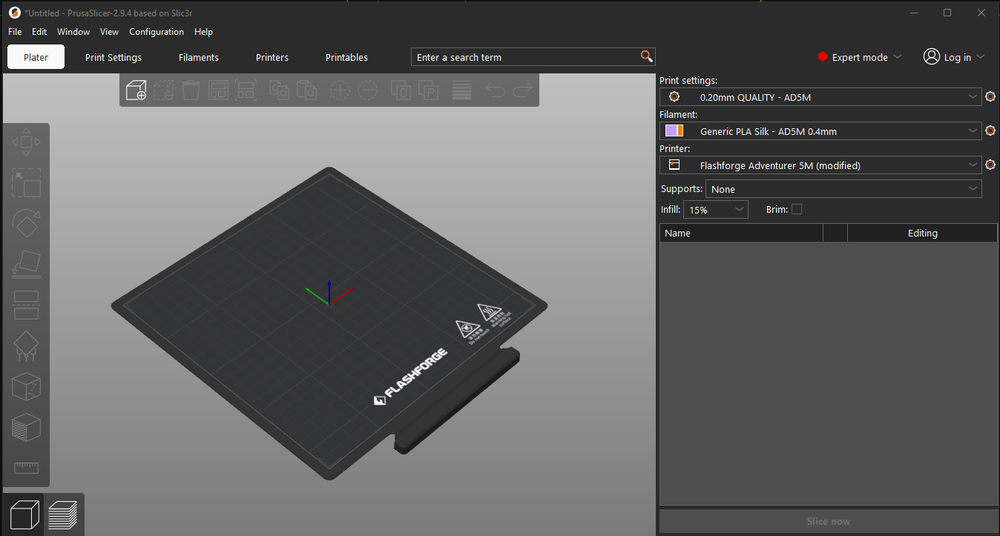

# Flashforge Adventurer 5M - Complete PrusaSlicer Bundle



**Created by: Brian S & Claude Sonnet 4.6 (Anthropic AI)**
*Tested and verified on real Flashforge Adventurer 5M hardware.*
*Released to the community freely — use, share, and improve!*

---

## What Is This?

A complete, fully working PrusaSlicer setup for the Flashforge Adventurer 5M.
Everything you need to slice and WiFi-upload directly to your AD5M from PrusaSlicer — **USB Not required!**

All known issues with bed origin, thumbnails, purge line, and G-code compatibility have been corrected and verified on a real FFAD5M printer.

---

## What's Included

| File | Description |
|------|-------------|
| `Flashforge_Adventurer_5M_PrusaSlicer_v2.1.ini` | Complete PrusaSlicer config bundle |
| `send_to_ad5m.py` | WiFi upload Python script v7.2 — Upload / Upload+Print / Cancel / Verified |
| `AD5M_Bed_Texture_Official.png` | Custom bed texture with official Flashforge branding |
| `AD5M_Printer_Model.stl` | Official Flashforge bed plate model |
| `LICENSE` | CC BY-NC 4.0 License |
| `README.md` | This file |

---

## What's In The Config Bundle

### Printer Profile
- Bed Shape: 220x220mm centered origin (-110 to +110)
- Bed Type: Stock Textured PEI Build Plate
- Thumbnails: 140x110 PNG (displays correctly on touchscreen)
- Purge line: centered front of bed X=-50 to X=+50 at Y=-100
- G-code flavor: Marlin compatible
- WiFi upload post-processing baked into all print profiles

### Print Profiles (3)
- **0.10mm DETAIL** — Fine detail, slower speed
- **0.20mm QUALITY** — Best balance of quality and speed *(recommended)*
- **0.30mm DRAFT** — Fast prototyping

### Filament Profiles (8)
- Generic PLA
- Generic PETG
- Generic TPU 95A *(direct drive optimized)*
- Generic ABS *(open frame notes included)*
- Generic PLA Silk *(corrected temperatures)*
- Generic HS PLA *(High Speed)*
- Generic PLA-CF *(0.6mm hardened nozzle required)*
- Generic Pro PCTG

---

## Requirements

- PrusaSlicer 2.9.4 or later
- Python 3.x — [Download here](https://www.python.org/downloads/)
- Flashforge Adventurer 5M connected to WiFi
- tkinter (included with standard Python installation)

---

## Installation

### STEP 1 — Install Python
- Download Python 3.x from [python.org](https://www.python.org/downloads/)
- During install **CHECK "Add Python to PATH"**
- Note your install path:
  `C:\Users\YOUR_NAME\AppData\Local\Programs\Python\Python3xx\`

### STEP 2 — Copy and Configure the WiFi Upload Script
- Copy `send_to_ad5m.py` to:
  `C:\Users\YOUR_NAME\Documents\PrusaSlicer\send_to_ad5m.py`
- Open in Notepad and edit the PRINTER SETTINGS section:
```python
PRINTER_IP     = "192.168.1.xxx"   # Your printer's IP address
PRINTER_SERIAL = "XXXXXXXXXXXX"    # Your printer's serial number
CHECK_CODE     = "xxxxxxxx"        # Your printer's check code (8 chars)
```

**How to find your printer settings:**
| Setting | Location on Printer |
|---------|-------------------|
| IP Address | Touchscreen → Settings → Network → IP Address |
| Serial Number | Touchscreen → Settings → About → Serial Number |
| Check Code | Touchscreen → Settings → About → Check Code |

### STEP 3 — Import the Config Bundle
- Open PrusaSlicer
- Go to: **File → Import → Import Config Bundle**
- Select: `Flashforge_Adventurer_5M_PrusaSlicer_v2.1.ini`
- Click OK on any warnings about substituted values
- Your Flashforge AD5M printer and all profiles will now appear in PrusaSlicer

### STEP 4 — Set Up the Bed Texture *(optional but recommended)*
- In PrusaSlicer go to: **Printers Settings → General → Bed Shape → Set**
- Under **Texture** click the folder icon → select `AD5M_Bed_Texture_Official.png`
- Under **Model** click the folder icon → select `AD5M_Printer_Model.stl`
- Click OK

### STEP 5 — Add the Post-Processing Script to Each Print Profile
- Select a print profile from the **Print Settings** dropdown
  *(look for: 0.10mm DETAIL - AD5M, 0.20mm QUALITY - AD5M, 0.30mm DRAFT - AD5M)*
- Go to: **Print Settings → Output Options → Post-processing scripts**
- Add the following line using YOUR paths:
```
C:\Users\YOUR_NAME\AppData\Local\Programs\Python\Python3xx\python.exe "C:\Users\YOUR_NAME\Documents\PrusaSlicer\send_to_ad5m.py";
```

- Click the **Save icon** (floppy disk) next to the print profile name
- Repeat for all three print profiles

### STEP 6 — Test a Full Slice and Upload
- Import any STL model into PrusaSlicer
- Select **Flashforge Adventurer 5M** as your printer
- Select **0.20mm QUALITY - AD5M** as your print profile
- Click **Slice**
- Click **Export G-code**
- **PrusaSlicer save dialog** opens — save your local .gcode file to your computer
- **Upload dialog** opens automatically with three options:

| Button | Action |
|--------|--------|
| **Upload** | Transfers file to printer storage. Start print manually from touchscreen. |
| **Upload + Print** | Transfers file then immediately starts printing. No touchscreen needed. |
| **Cancel** | Aborts without sending anything. |

- The dialog pre-fills with your actual save filename automatically
  *(no more cryptic temp names — what you saved is what you see)*
- Edit the name if desired or accept as-is. .gcode extension added automatically.
- Console window shows upload progress and verification:
```
============================================================
  Flashforge AD5M - WiFi Upload v7.2
============================================================
  Filename from PrusaSlicer: MyPart_PLA.gcode
  [1/6] Connecting...
  [2/6] Requesting control...
  [3/6] Authenticating...
  [4/6] Initiating upload...
  [5/6] Uploading... [█████████████████████░░░░░░░] 72% 4521 KB/s
  [6/6] Finalizing...
  [V]   Verifying upload...

  SUCCESS! MyPart_PLA.gcode is ready on the printer.
  Upload verified - file confirmed on printer.
============================================================
  Closing in 5s...
```

- Find your file on the printer touchscreen — ready to print!

> **Important — Upload + Print:** The printer must be **idle**. If a print is already
> running the script will report a connection error. This is expected firmware behavior.

---

## How the WiFi Upload Works

The script communicates with the AD5M over TCP port 8899 using the Flashforge proprietary protocol:

**Upload:**
1. Connects to printer IP on port 8899
2. Requests printer control (~M601)
3. Authenticates with serial and check code (~M602)
4. Initiates file transfer (~M28)
5. Streams G-code data in 4KB chunks
6. Finalizes transfer (~M29)
7. Verifies file on printer (~M661)
8. Releases printer control (~M602)

**Upload + Print (additional steps after upload):**

9. Selects the uploaded file (~M23)
10. Starts the print (~M24)

---

## Known Issues and Notes

- **ABS** prints well open frame for smaller parts. Larger parts are more susceptible to warping and layer splitting — an enclosure helps. Good ventilation recommended.
- **PLA-CF** requires a hardened nozzle (0.6mm minimum). Do NOT use with the stock 0.4mm brass nozzle.
- **PCTG** bonds very strongly to bare PEI. Always apply PVA glue stick to the bed before printing PCTG.

---

## Troubleshooting

**Upload fails / connection refused:**
- Is printer powered on and connected to WiFi?
- Ping your printer to verify network connectivity:
  `ping 192.168.1.xxx` *(replace with your printer IP)*
- Verify IP address in script matches printer network settings
- Check printer is not currently printing (required for Upload + Print)
- Check no other app is connected to the printer on port 8899

**Upload reports SUCCESS but verification fails:**
- Another app is connected to the printer and holding the TCP session
- Close any other printer control apps before uploading
- Only one TCP connection to port 8899 is allowed at a time

**Script crashes with "getaddrinfo failed":**
- PRINTER_IP in `send_to_ad5m.py` is blank or not a valid IP address
- Open the script in Notepad and verify PRINTER_IP is set correctly
  *(example: `"192.168.1.25"` — not a hostname or placeholder)*

**Wrong serial/check code error:**
- Double check on printer touchscreen → Settings → About

**Script not running after slice:**
- Verify Python path in post-processing script field is correct
- Verify post-processing script is saved in each print profile

---

## License

This work is licensed under the
[Creative Commons Attribution-NonCommercial 4.0 International License](https://creativecommons.org/licenses/by-nc/4.0/)

You are free to share and adapt this work for non-commercial purposes
with appropriate attribution to **Brian & Claude Sonnet 4.6 (Anthropic AI)**.

---

## Credits

Developed through extensive testing and troubleshooting on a real Flashforge Adventurer 5M printer.

Bed texture designed to accurately represent the actual AD5M print bed including official Flashforge branding, safety markings, and grid overlay.

WiFi upload protocol based on Flashforge network communication and community documentation.

*Give back. Share freely. Help others.* 🙏

---

## Version History

| Version | Changes |
|---------|---------|
| v2.4 | send_to_ad5m.py updated to v7.2 — uses SLIC3R_PP_OUTPUT_NAME environment variable to get the real filename from PrusaSlicer. Dialog pre-fills with the actual save name. No more dot-prefix workaround. Workflow is now: Slice → Save → Upload → Print. |
| v2.3 | send_to_ad5m.py updated to v7.1 — M661 upload verification confirms file landed on printer, loud FAILED alert if verification fails, 5 second result pause so you can read the outcome, American English spelling throughout. New troubleshooting entry: verification failure / other app holding TCP session. |
| v2.2 | send_to_ad5m.py updated to v7.0 — added Upload+Print button, highlights filename in dialog, double-extension bug fixed. README updated for Upload+Print workflow and new troubleshooting entries. |
| v2.1 | Fixed Windows path backslashes, removed personal credentials, official Flashforge bed model, compressed bed texture, CC BY-NC 4.0 license, PrusaSlicer screenshot added |
| v2.0 | Corrected bed origin (centered), fixed thumbnails (140x110), corrected purge line, fixed host_type for PrusaSlicer 2.9.4, corrected Silk PLA temperatures, added rename dialog to WiFi upload script |
| v1.0 | Initial release |
